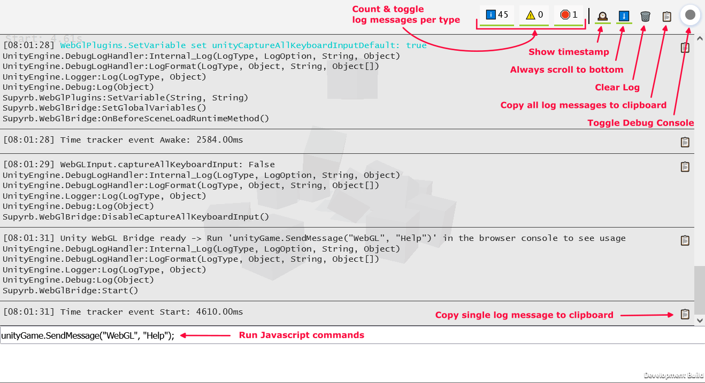

# Unity WebGL Loading Test


[](https://github.com/JohannesDeml/UnityWebGL-LoadingTest/releases) [](https://unity3d.com/get-unity/download/archive)

*Testing Unity's WebGL size and loading time for different versions (2018.4 - 2022.2) and platforms*  

* [Unity Forum Thread](https://forum.unity.com/threads/webgl-builds-for-mobile.545877/)
* [Overview page of all builds](https://deml.io/experiments/unity-webgl/)


## Features

* Physics
* GPU Instancing for materials
* Shadows
* Brotli Compression
* Togglable In-DOM Debug console
  
* Easy access to unity functions through the browser console ([Demo](https://deml.io/experiments/unity-webgl/2020.3.23f1/)|[Youtube](https://youtu.be/OjypxsD6XMI))
* Handy debug functions for times and memory consumption
* Responsive template layout for maximum mobile compatibility
* Github Actions to automatically build the project and deploy it on the server via [Game CI](https://game.ci/)
* Works with [Unity WebGL Publisher](https://play.unity.com/discover/all-showcases) (Use  [2020.3-lts](https://github.com/JohannesDeml/UnityWebGL-LoadingTest/tree/2020-lts) or [2020.3-lts-urp](https://github.com/JohannesDeml/UnityWebGL-LoadingTest/tree/2020-lts-urp) branch)
* Tracking multiple Unity versions starting from 2018.4

## Live Demos

### Built-in Renderpipeline WebGL2
Version | Size | Link
--- | --- | ---
2022.2.2f1 | 2.93 MB | https://deml.io/experiments/unity-webgl/2022.2.2f1-webgl2
2022.1.24f1 | 2.80 MB | https://deml.io/experiments/unity-webgl/2022.1.24f1-webgl2
2021.3.16f1 | 2.74 MB | https://deml.io/experiments/unity-webgl/2021.3.16f1-webgl2
2021.2.19f1 | 2.58 MB | https://deml.io/experiments/unity-webgl/2021.2.19f1-webgl2
2021.1.28f1 | 2.94 MB | https://deml.io/experiments/unity-webgl/2021.1.28f1-webgl2
2020.3.44f1 | 2.93 MB | https://deml.io/experiments/unity-webgl/2020.3.44f1-webgl2
2019.4.40f1 | 3.04 MB | https://deml.io/experiments/unity-webgl/2019.4.40f1-webgl2
2018.4.36f1 | 2.83 MB | https://deml.io/experiments/unity-webgl/2018.4.36f1-webgl2

### Built-in Renderpipeline WebGL1
Version | Size | Link
--- | --- | ---
2022.2.2f1 | 2.91 MB | https://deml.io/experiments/unity-webgl/2022.2.2f1-webgl1
2022.1.24f1 | 2.78 MB | https://deml.io/experiments/unity-webgl/2022.1.24f1-webgl1
2021.3.16f1 | 2.72 MB | https://deml.io/experiments/unity-webgl/2021.3.16f1-webgl1
2021.2.19f1 | 2.56 MB | https://deml.io/experiments/unity-webgl/2021.2.19f1-webgl1
2021.1.28f1 | 2.92 MB | https://deml.io/experiments/unity-webgl/2021.1.28f1-webgl1
2020.3.44f1 | 2.92 MB | https://deml.io/experiments/unity-webgl/2020.3.44f1-webgl1
2019.4.40f1 | 3.01 MB | https://deml.io/experiments/unity-webgl/2019.4.40f1-webgl1
2018.4.36f1 | 2.82 MB | https://deml.io/experiments/unity-webgl/2018.4.36f1-webgl1

### Built-in Renderpipeline WebGL1 Minimum size
Version | Size | Link
--- | --- | ---
2022.2.2f1 | 2.69 MB | https://deml.io/experiments/unity-webgl/2022.2.2f1-minsize-webgl1
2022.1.24f1 | 2.64 MB | https://deml.io/experiments/unity-webgl/2022.1.24f1-minsize-webgl1
2021.3.16f1 | 2.58 MB | https://deml.io/experiments/unity-webgl/2021.3.16f1-minsize-webgl1
2021.2.19f1 | 2.42 MB | https://deml.io/experiments/unity-webgl/2021.2.19f1-minsize-webgl1
2021.1.28f1 | 2.48 MB | https://deml.io/experiments/unity-webgl/2021.1.28f1-minsize-webgl1
2020.3.44f1 | 2.48 MB | https://deml.io/experiments/unity-webgl/2020.3.44f1-minsize-webgl1
2019.4.40f1 | 2.98 MB | https://deml.io/experiments/unity-webgl/2019.4.40f1-minsize-webgl1
2018.4.36f1 | 2.79 MB | https://deml.io/experiments/unity-webgl/2018.4.36f1-minsize-webgl1

### URP WebGL2
Version | Size | Link
--- | --- | ---
2022.2.2f1 | 6.86 MB | https://deml.io/experiments/unity-webgl/2022.2.2f1-urp-webgl2
2022.1.24f1 | 6.44 MB | https://deml.io/experiments/unity-webgl/2022.1.24f1-urp-webgl2
2021.3.16f1 | 6.25 MB | https://deml.io/experiments/unity-webgl/2021.3.16f1-urp-webgl2
2021.2.19f1 | 6.18 MB | https://deml.io/experiments/unity-webgl/2021.2.19f1-urp-webgl2
2021.1.28f1 | 5.80 MB | https://deml.io/experiments/unity-webgl/2021.1.28f1-urp-webgl2
2020.3.44f1 | 5.57 MB | https://deml.io/experiments/unity-webgl/2020.3.44f1-urp-webgl2
2019.4.40f1 | 5.55 MB | https://deml.io/experiments/unity-webgl/2019.4.40f1-urp-webgl2
2018.4.36f1 | 2.80 MB | https://deml.io/experiments/unity-webgl/2018.4.36f1-urp-webgl2

### URP WebGL1
Version | Size | Link
--- | --- | ---
2022.2.2f1 | 6.74 MB | https://deml.io/experiments/unity-webgl/2022.2.2f1-urp-webgl1
2022.1.24f1 | 6.31 MB | https://deml.io/experiments/unity-webgl/2022.1.24f1-urp-webgl1
2021.3.16f1 | 6.07 MB | https://deml.io/experiments/unity-webgl/2021.3.16f1-urp-webgl1
2021.2.19f1 | 5.99 MB | https://deml.io/experiments/unity-webgl/2021.2.19f1-urp-webgl1
2021.1.28f1 | 5.57 MB | https://deml.io/experiments/unity-webgl/2021.1.28f1-urp-webgl1
2020.3.44f1 | 5.41 MB | https://deml.io/experiments/unity-webgl/2020.3.44f1-urp-webgl1
2019.4.40f1 | 5.50 MB | https://deml.io/experiments/unity-webgl/2019.4.40f1-urp-webgl1
2018.4.36f1 | 2.80 MB | https://deml.io/experiments/unity-webgl/2018.4.36f1-urp-webgl1


## Platform Compatibility

| Platform   | Chrome | Firefox | Edge | Safari | Internet Explorer |
| ---------- | :----: | :-----: | :--: | :----: | :---------------: |
| Windows 10 |   ✔️    |    ✔️    |  ✔️   |   ➖    |         ❌         |
| Linux      |   ✔️    |    ✔️    |  ✔️   |   ➖    |         ➖         |
| Mac        |   ✔️    |    ✔️    |  ✔️   |   ✔️    |         ➖         |
| Android    |   ✔️    |    ✔️    |  ✔️   |   ➖    |         ➖         |
| iOS        |   ✔️    |    ✔️    |  ✔️   |   ✔️    |         ➖         |

✔️ *: Supported* | ⚠️ *: Warning , see below* | ❌ *: not supported* | ➖ *: Not applicable*

* For older Unity 2019 builds throw an error on **iOS Firefox** (Does not happen for iOS Safari or iOS Chrome): `An error occured running the Unity content on this page. See you browser JavaScript console for more info. The error: Script error.` - with iOS 16.2 and Firefox 108 I could not reproduce this problem anymore on 2019.4.
* Internet Explorer does not work for Unity WebGL builds, since it does not support wasm.
* Previous versions of Firefox on Android had some performance problems, they seemed to have fixed those. In general performance on mobile is by far not as good as a native app build, but should be enough for simple games.

## Notes

* There are some combinations for **iOS** that have **problems**: With recent versions **URP with WebGL 1** does not work at all and **builtin renderpipeline with WebGL 2** has performance problems or might not load at all. I recommend to either use URP with WebGL2 or builtin with WebGL1, if you are targeting iOS. You can always test the builds on your device, to see which combination might fit your needs: https://deml.io/experiments/unity-webgl/
* If you want to use this project as a basis for your project, be sure to select the release/branch for your unity version. Beta versions oftentimes have problems, therefore I would recommend to use the latest LTS version to run your project.
* The server is configured to support wasm streaming and brotli compression, see [.htaccess 2020](./Configuration/2020/.htaccess)  [.htaccess 2019](./Configuration/2019/.htaccess)
* Some servers (such as itch.io) don't support brotli compression, you should then use gzip compression instead. If brotli is missconfigured or not supported you will get an error along the lines of:
  ```
  Unable to parse Build/WEBGL.framework.js.br! This can happen if build compression was enabled but web server hosting the content was misconfigured to not serve the file with HTTP Response Header "Content-Encoding: br" present. Check browser Console and Devtools Network tab to debug.
  ```
  You can change the compression in the project settings:
  
* In order to get rid of the warning on android/iOS it is removed in a post process build step ([File](./Assets/Scripts/Editor/RemoveMobileSupportWarningWebBuild.cs))
* You might need to reload the page on android/iOS when running the first time
* This is a very small example. When building larger WebGL applications, you might run into problems with memory or compile errors. I recommend to build from the start and very often, to catch the changes that create those problems.
* If you want to have the smallest file size possible and faster load times, take a look at [Project Tiny](https://forum.unity.com/forums/project-tiny.151/) or web-specific libraries like [Three.js](https://threejs.org/) or [PlayCanvas](https://playcanvas.com/).
* Removing the default skybox will save ~30kb.
* With 2021.2 Unity added the possibility to use different texture formats. The builds use the default DXT format, but since no texture is used this settings does not make any difference in this project.

### URP
* URP adds additional ~2.5 MB file size compared to the builtin render pipeline.
* In general the performance for URP seems to be better compared to builtin, but it has a larger build size.
* With Unity 2021.2 there is currently a problem with shader compilation and therefore builds fail:
  ```
  Shader error in 'Hidden/Universal/CoreBlit': invalid subscript 'positionCS' at 
  UnityWebGL-LoadingTest/Library/PackageCache/com.unity.render-pipelines.core@12.1.0/Runtime/Utilities/Blit.hlsl(92) (on gles)
  Compiling Vertex program with DISABLE_TEXTURE2D_X_ARRAY
  Platform defines: SHADER_API_DESKTOP UNITY_COLORSPACE_GAMMA UNITY_ENABLE_DETAIL_NORMALMAP UNITY_LIGHTMAP_RGBM_ENCODING UNITY_PBS_USE_BRDF1 UNITY_SPECCUBE_BLENDING UNITY_SPECCUBE_BOX_PROJECTION UNITY_USE_DITHER_MASK_FOR_ALPHABLENDED_SHADOWS
  Disabled keywords: BLIT_SINGLE_SLICE SHADER_API_GLES30 UNITY_ASTC_NORMALMAP_ENCODING UNITY_ENABLE_NATIVE_SHADOW_LOOKUPS UNITY_ENABLE_REFLECTION_BUFFERS UNITY_FRAMEBUFFER_FETCH_AVAILABLE UNITY_HALF_PRECISION_FRAGMENT_SHADER_REGISTERS UNITY_HARDWARE_TIER1 UNITY_HARDWARE_TIER2 UNITY_HARDWARE_TIER3 UNITY_LIGHTMAP_DLDR_ENCODING UNITY_LIGHTMAP_FULL_HDR UNITY_LIGHT_PROBE_PROXY_VOLUME UNITY_METAL_SHADOWS_USE_POINT_FILTERING UNITY_NO_DXT5nm UNITY_NO_FULL_STANDARD_SHADER UNITY_NO_SCREENSPACE_SHADOWS UNITY_PBS_USE_BRDF2 UNITY_PBS_USE_BRDF3 UNITY_PRETRANSFORM_TO_DISPLAY_ORIENTATION UNITY_UNIFIED_SHADER_PRECISION_MODEL UNITY_VIRTUAL_TEXTURING
  
  
  Shader error in 'Hidden/kMotion/CameraMotionVectors': SV_VertexID semantic is not supported on GLES 2.0 at line 11 (on gles)
  
  Compiling Subshader: 0, Pass: , Vertex program with <no keywords>
  Platform defines: SHADER_API_DESKTOP UNITY_COLORSPACE_GAMMA UNITY_ENABLE_DETAIL_NORMALMAP UNITY_LIGHTMAP_RGBM_ENCODING UNITY_PBS_USE_BRDF1 UNITY_SPECCUBE_BLENDING UNITY_SPECCUBE_BOX_PROJECTION UNITY_USE_DITHER_MASK_FOR_ALPHABLENDED_SHADOWS
  Disabled keywords: SHADER_API_GLES30 UNITY_ASTC_NORMALMAP_ENCODING UNITY_ENABLE_NATIVE_SHADOW_LOOKUPS UNITY_ENABLE_REFLECTION_BUFFERS UNITY_FRAMEBUFFER_FETCH_AVAILABLE UNITY_HALF_PRECISION_FRAGMENT_SHADER_REGISTERS UNITY_HARDWARE_TIER1 UNITY_HARDWARE_TIER2 UNITY_HARDWARE_TIER3 UNITY_LIGHTMAP_DLDR_ENCODING UNITY_LIGHTMAP_FULL_HDR UNITY_LIGHT_PROBE_PROXY_VOLUME UNITY_METAL_SHADOWS_USE_POINT_FILTERING UNITY_NO_DXT5nm UNITY_NO_FULL_STANDARD_SHADER UNITY_NO_SCREENSPACE_SHADOWS UNITY_PBS_USE_BRDF2 UNITY_PBS_USE_BRDF3 UNITY_PRETRANSFORM_TO_DISPLAY_ORIENTATION UNITY_UNIFIED_SHADER_PRECISION_MODEL UNITY_VIRTUAL_TEXTURING
  ```
* URP on mobile runs a lot better with WebGL 2 than WebGL 1 on iOS. For example compare [2021.3.6f1 URP WebGL1](https://deml.io/experiments/unity-webgl/2021.3.6f1-urp) with [2021.3.6f1 URP WebGL2](https://deml.io/experiments/unity-webgl/2021.3.6f1-urp-webgl2) on your iPhone.
* Unity 2022.1 has problems building for URP with WebGL1 (also on desktop), error:
  ```
  Texture creation failed. 'ShadowAuto' is not supported for Render usage on this platform. Use 'SystemInfo.IsFormatSupported' C# API to check format support.
  
  NullReferenceException: Object reference not set to an instance of an object.
  ```

### Min Size builds
* Built with `Tools/Build WebGL/minsize`
* Built with Code Optimization: `Size`
* Enable Exceptions: `None`
* C++ Compiler Configuration: `Master` 

## Browser Console commands

*This functionality was added 2021-11-21 and is only supported by releases starting at that date*

The script `WebGlBridge` adds an easy to access gameobject that can be called from the browser console through `unityGame.SendMessage("WebGL", "COMMAND_NAME",PARAMETER)`

Currently the following commands are available:

```javascript
unityGame.SendMessage("WebGL", "DisableCaptureAllKeyboardInput"); -> Disable unity from consuming all keyboard input
unityGame.SendMessage("WebGL", "EnableCaptureAllKeyboardInput"); -> Enable unity from consuming all keyboard input
unityGame.SendMessage("WebGL", "LogMemory"); -> Logs the current memory
unityGame.SendMessage("WebGL", "SetApplicationRunInBackground", System.Int32 runInBackground); -> Application.runInBackground
unityGame.SendMessage("WebGL", "SetApplicationTargetFrameRate", System.Int32 targetFrameRate); -> Application.targetFrameRate
unityGame.SendMessage("WebGL", "SetTimeFixedDeltaTime", System.Single fixedDeltaTime); -> Time.fixedDeltaTime
unityGame.SendMessage("WebGL", "SetTimeTimeScale", System.Single timeScale); -> Time.timeScale
unityGame.SendMessage("WebGL", "ToggleInfoPanel"); -> Toggle develop ui visibility of InfoPanel
unityGame.SendMessage("WebGL", "LogExampleMessage"); -> Log an example debug message
unityGame.SendMessage("WebGL", "LogMessage", "System.String message"); -> Log a custom message
unityGame.SendMessage("WebGL", "Help"); -> Log all available commands
```

## Github Build Actions

This repository supports continuous Integration through [game.ci](https://game.ci/). There are scripts for creating a unity license, building the project and upgrading the project.

### Automatic builds
The main github actions workflow is [release.yml](./.github/workflows/release.yml). On Unity side a custom build script on the basis of [game.ci's BuildScript](https://github.com/game-ci/documentation/blob/main/example/BuildScript.cs) is used: [BuildScript.cs](./Assets/Scripts/Editor/BuildScript.cs). This script supports defining different build logic through git tags through the following syntax: `UNITY_VERSION`-`TAG1`-`TAG2`... Example: `2022.2.0f1-urp-webgl2`

The following tags are supported:

* `minsize`: Set Code optimization to size and and don't support exceptions
* `debug`: Build a development build with embedded debug symbols and full stack trace
* `webgl1`: Build for WebGL1
* `webgl2`: Build for WebGL2

### Upgrade Unity CI

For upgrading Unity [upgrade-unity.yml](./.github/workflows/upgrade-unity.yml) is used. It can be triggered through github actions manually by defining the branch to upgrade and some additional settings

It will create a pull request with the newly defined unity version along with tags to trigger automatic builds. Additionally, all packages are updated to their latest version, see also [UnityPackageScripts.cs](./Assets/Scripts/Editor/UnityPackageScripts.cs).

## Older versions

You can find a list of all live builds with their sizes over here: https://deml.io/experiments/unity-webgl/

## License

* MIT (c) Johannes Deml - see [LICENSE](./LICENSE.md)